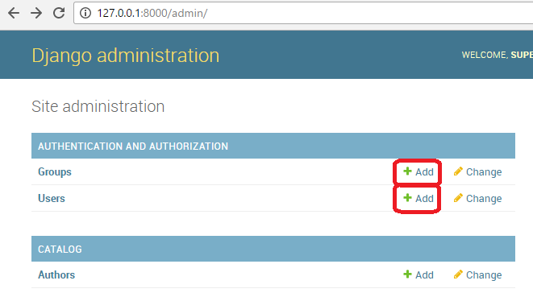
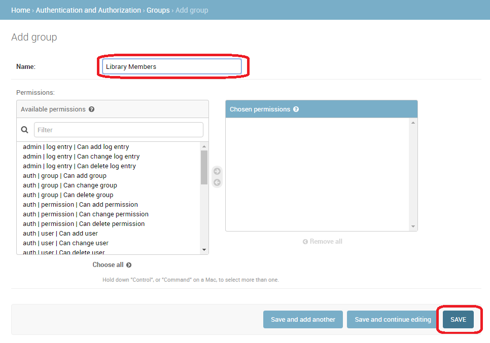
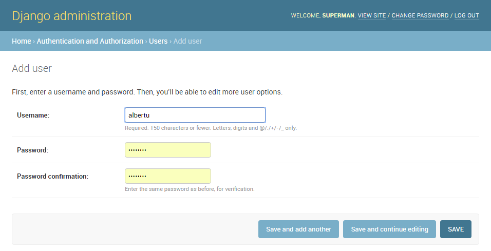
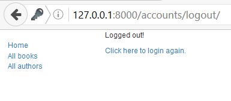

Django 튜토리얼 8부: 사용자 인증 및 사용 권한
---------------------------------------------

---

이 단원에서는 사용자가 자신의 계정으로 사이트에 로그인 할 수 있도록 하는 방법과 로그인 여부 및 사용 권한에 따라 수행하고 볼 수있는 권한 제어 방법을 설명합니다. 이 데모의 일부로 [LocalLibrary](tutorialLocalLibraryWebsite.md) 웹사이트를 확장하여 로그인 및 로그아웃 페이지를 추가하고 대출한 책을 볼 수 있는 사용자 및 사서 페이지를 확장합니다.

> 선수지식: [Django 튜토리얼 7부: 세션 프레임워크](sessions.md)까지 모든 튜토리얼들을 숙지하고 있어야 합니다.
>
> 목표: 사용자 인증 및 사용 권한을 설정하고 사용하는 방법을 이해합니다.

---

### 개요

Django는 사용자 인증 정보를 확인하고 각 사용자가 수행할 수있는 작업을 정의할 수 있는 [이전 단계](sessions.md)에서 설명한 세션 프레임워크 위에서 구축된 인증 및 권한 부여 ("허가") 시스템을 제공합니다. 프레임워크는 <code>Users</code>와 <code>Groups</code> (한 번에 둘 이상의 사용자에게 사용 권한을 적용하는 일반적인 방법), 사용자가 작업을 수행 가능 여부를 지정하는 허가/플래그, 사용자 로그인 양식과 뷰 및 컨텐츠를 제한하기 위한 뷰 도구에 대한 내재된 모델을 포함하고 있습니다.

> <b>Note</b>: Django는 제네릭한 인증 시스템을 목표로 하므로 다른 웹 인증 시스템에서 제공하는 일부 기능을 제공하지 않습니다. 일부 공통 문제에 대한 솔루션은 타사 패키지로 제공됩니다. 예를 들어 로그인 시도 제한, 제 3자 인증(예 : OAuth) 등입니다.

이 단원에서는 [LocalLibrary](tutorialLocalLibraryWebsite.md) 웹사이트에서 사용자 인증을 활성화하고, 로그인 및 로그아웃 페이지를 만들고, 모델에 권한을 부여하고, 페이지에 대한 접근를 제어하는 방법을 설명합니다. 사용자와 사서 모두가 빌린 도서 목록을 표시하기 위해 인증/권한을 사용합니다.

인증 시스템은 매우 유연하며 사용자를 로그인하기 위하여 제공되는 API를 호출하여 URL, 양식, 뷰와 템플리트를 처음부터 새로 만들 수 있습니다. 그러나 이 단계에서는 로그인과 로그아웃 페이지에 Django의 "stock" 인증 뷰와 양식을 사용하려고 합니다. 여전히 템플리트를 만들어야 하지만 어렵지 않습니다.

또한 권한을 생성하고, 로그인 상태에서 뷰와 템플리트의 사용 권한을 확인하는 방법을 보여줍니다.

---

### 인증 활성화

[Django 튜토리얼 2부: 웹사이트 골조 만들기](skeletonWebsite.md)에서 인증이 자동으로 활성화되었으므로 더 이상의 작업이 필요 없습니다.

> <b>Note</b>: <code>django-admin startproject</code> 명령으로 어플리케이션을 만들 때 필요한 구성을 모두 완료하였습니다. 사용자와 모델 권한에 대한 데이터베이스 테이블은 처음에 <code>python manage.py migrate</code>를 수행했을 때 만들어졌습니다.

프로젝트 파일(<b>locallibrary/locallibrary/settings.py</b>)의 <code>INSTALLED_APPS</code>와 <code>>MIDDLEWARE</code> 섹션에서 다음과 같이 구성을 설정합니다.

```python
INSTALLED_APPS = [
    ...
    'django.contrib.auth',  #Core authentication framework and its default models.
    'django.contrib.contenttypes',  #Django content type system (allows permissions to be associated with models).
    ....

MIDDLEWARE = [
    ...
    'django.contrib.sessions.middleware.SessionMiddleware',  #Manages sessions across requests
    ...
    'django.contrib.auth.middleware.AuthenticationMiddleware',  #Associates users with requests using sessions.
    ....
```

---

### 사용자와 그룹 생성

[Django 튜토리얼 4부: Django 관리 사이트](adminSite.md)에서 이미 첫 번째 사용자를 만들었습니다 (이떄 수퍼유저로서 <code>python manage.py createsuperuser</code> 명령을 사용하여 만들었습니다). 수퍼유저는 이미 인증을 받았으며 모든 권한을 가지고 있으므로 일반 사용자를 대표하는 테스트 사용자를 만들어야 합니다. 가장 빠른 방법 중 하나로 <i>locallibrary</i> 그룹과 웹사이트 로그인을 만들기 위해 admin 사이트를 사용할 것입니다.

> <b>Note</b>: 아래와 같이 프로그래밍으로 사용자를 만들 수도 있습니다. 예를 들어 사용자가 자신의 로그인을 만들 수 있는 인터페이스를 개발하는 경우 (사용자에게 관리 사이트에 대한 접근 권한 부여를 해서는 안 됨) 이 작업을 수행해야 합니다.

```python
from django.contrib.auth.models import User

# Create user and save to the database
user = User.objects.create_user('myusername', 'myemail@crazymail.com', 'mypassword')

# Update fields and then save again
user.first_name = 'John'
user.last_name = 'Citizen'
user.save()
```

아래에서 먼저 그룹을 만든 다음 사용자를 만듭니다. 아직 도서관 회원을 추가 할 수 있는 권한이 없지만 나중에 필요할 경우 사용자 각각에 추가하는 것보다 훨씬 쉽게 그룹에 추가할 수 있습니다.

개발 서버를 시작하고 로컬 웹 브라우저에서 [관리 사이트](http://127.0.0.1:8000/admin/)로 이동하십시오. 수퍼유저 계정의 자격 증명을 사용하여 사이트에 로그인합니다. Admin 사이트의 최상위 레벨에서 모든 모델을 "Django application"으로 정렬하여 보여줍니다. <b>Authentication and Authorisation</b> 섹션에서 <b>Users</b> 또는 <b>Groups</b> 링크를 클릭하여 기존 레코드를 볼 수 있습니다.



먼저 도서관 회원을 위한 새로운 그룹을 생성합니다.

1.	새 그룹을 생성하려면 그룹 옆 <b>Add</b> 버튼을 클릭하십시오. 그룹의 <b>Name</b>에 "Library Members"을 입력하십시오. 
2.	그룹에 대한 권한이 필요하지 않으므로 <b>SAVE</b>를 누르십시오 (그룹 목록으로 이동할 것입니다).

이제 사용자를 생성합니다.

-	관리 사이트의 홈 페이지로 돌아갑니다.
-	<i>Users</i> 옆에 있는 <b>Add</b> 버튼을 클릭하여 <i>Add user</i> 대화 상자를 엽니다. 
-	테스트 사용자를 위한 적절한 Username과 Password/Password confirmation을 입력하십시오.
-	<b>SAVE</b>를 눌러 사용자를 만듭니다.

관리 사이트는 새로운 사용자를 생성하고 즉시 <b>username</b> 변경 및 사용자 모델의 선택적 필드에 대한 정보를 추가할 수 있는 <i>Change user</i> 화면으로 이동합니다. 이름, 성, 전자 메일 주소 및 사용자의 상태와 권한(<b>Active</b> 플래그만 설정할 수 있음) 필드 등이 있습니다. 아래에서 사용자의 그룹과 권한을 지정하고 사용자와 관련된 중요한 날짜(예: 가입 날짜와 마지막 로그인 날짜)를 볼 수 있습니다. 

-	<i>Groups</i> 섹션의 <i>Available groups</i> 목록에서 <b>Library Members</b> 그룹을 선택한 다음 상자 사이의 <b>오른쪽 화살표</b>를 눌러 <i>Chosen groups</i> 상자로 이동하십시오. 
-	여기서 다른 작업을 수행할 필요가 없으므로 <b>SAVE</b>를 다시 선택하여 사용자 목록으로 이동하십시오.

이제 (일단 로그인할 수 있도록 페이지를 구현한 경우) 테스트를 위해 사용할 수있는 "도서관 일반 회원" 계정을 만들었습니다.

> <b>Note</b>: 라이브러리 다른 사용자를 만들어야합니다. 또한 사서를 위한 그룹을 만들고 그 그룹에 사용자를 추가하십시오.

---

### 인증 뷰 설정

Django는 로그인, 로그 아웃 및 패스워드 관리 "out of the box" 를 처리하는 인증 페이지를 만드는 데 필요한 거의 모든 것을 제공합니다. 여기에는 URL 매퍼, 뷰와 양식이 포함되지만 템플리트는 포함되지 않으므로 직접 작성해야 합니다.

이 섹션에서는 이 기본 시스템을 <i>LocalLibrary</i> 웹사이트에 통합하고 템플리트를 만드는 방법을 보여줍니다. 이를 기본 프로젝트 URL에 추가합니다.

> <b>Note</b>: 이 코드를 꼭 사용할 필요는 없지만 일을 훨씬 쉽게 할 수 있으므로 필요할 것입니다. 사용자 모델을 변경하는 경우 거의 확실하게 양식 처리 코드를 변경해야 하지만 그래도 여전히 스톡 뷰 기능을 사용할 수 있습니다.
>
> <b>Note</b>: 이 경우 카탈로그 어플리케이션에 URL과 템플리트를 비롯한 인증 페이지를 합리적으로 저장할 수 있습니다. 그러나 여러 개의 어플리케이션을 사용하는 경우 이 공유 로그인 동작을 분리하여 전체 사이트에서 사용할 수 있도록 하는 것이 좋을 것입니다.

#### Project URLs

프로젝트 urls.py 파일 (<b>locallibrary/locallibrary/urls.py</b>) 파일의 아래에 다음을 추가하십시오.

```python
#Add Django site authentication urls (for login, logout, password management)
urlpatterns += [
    path('accounts/', include('django.contrib.auth.urls')),
]
```

http://127.0.0.1:8000/accounts/ URL (슬래시로 끝나는 것에 주의하십시오)로 이동하면 Django는이 URL을 찾을 수 없다는 오류를 표시하고 시도한 모든 URL을 나열합니다. 여기에서 작동할 URL을 볼 수 있습니다. 예를 들면 다음과 같습니다.

> <b>Note</b>: 위의 메소드를 사용하면 대괄호 안에 이름과 다음 URL을 추가하여 URL 매핑을 역으로 사용할 수 있습니다. 위의 URL 매핑은 아래에 언급 된 URL을 자동으로 매핑합니다.

```python
accounts/ login/ [name='login']
accounts/ logout/ [name='logout']
accounts/ password_change/ [name='password_change']
accounts/ password_change/done/ [name='password_change_done']
accounts/ password_reset/ [name='password_reset']
accounts/ password_reset/done/ [name='password_reset_done']
accounts/ reset/<uidb64>/<token>/ [name='password_reset_confirm']
accounts/ reset/done/ [name='password_reset_complete']
```

이제 로그인 URL(http://127.0.0.1:8000/accounts/login/)으로 이동 하십시오. 이 작업이 다시 실패 하겠지만 템플리트 검색 경로에 필수 템플리트(<b>registration/login.html</b>)이 누락되었다는 오류가 나타납니다. 상단의 노란색 섹션에 다음 줄이 표시됩니다.

```python
Exception Type:    TemplateDoesNotExist
Exception Value:    registration/login.html
```

다음 단계는 검색 경로에 registration 폴더를 생성한 다음 <b>login.html</b> 파일을 추가하는 것입니다.

#### 템플리트 폴더

방금 추가한 URL(과 내재된 views)을 템플리트 검색 경로의 디렉토리 /<b>registration</b>/의 관련 템플리트에서 찾을 수 있습니다.

이 사이트에서는 HTML 페이지를 <b>templates</b>/<b>registration</b>/ 디렉토리에 저장합니다. 이 디렉토리는 프로젝트 루트 디렉토리 (즉, <b>catalog</b>와 <b>locallibrary</b> 폴더가 저장된 디렉토리)에 있어야 합니다. 지금이 폴더를 만드십시오.

> <b>Note</b>: ㅇㅣ제 폴더 구조는 아래과 같이 보입니다.

```python
locallibrary (Django project folder)
   |_catalog
   |_locallibrary
   |_templates (new)
                |_registration
```

이 디렉토리를 템플리트 로더가 사용할 수 있도록 하려면 (즉, 이 디렉토리를 템플리트 검색 경로에 넣으려면) 프로젝트 설정 (<b>/locallibrary/locallibrary/settings.py</b>)을 열고 아래와 같이 <code>TEMPLATES</code> 섹션의 <code>'DIRS'</code> 행을 업데이트하십시오.

```python
TEMPLATES = [
    {
        ...
        'DIRS': [os.path.join(BASE_DIR, 'templates')],
        'APP_DIRS': True,
        ...
```

#### Login 템플리트

> <b>Important</b>: 이 단원에서 제공하는 인증 템플리트는 Django 데모 로그인 템플리트의 매우 기본적인 버전을 조금 수정한 것입니다. 프로젝트 맞춤형으로 템플리트를 정의할 수도 있습니다.

<b>/locallibrary/templates/registration/</b>에 <b>login.html</b>이라는 HTML 파일을 다음 내용으로 생성하십시오.

```HTML





  <p>Your username and password didn't match. Please try again.</p>



  
    <p>Your account doesn't have access to this page. To proceed,
    please login with an account that has access.</p>
  
    <p>Please login to see this page.</p>
  


<form method="post" action="">

<table>

<tr>
  <td>{{ form.username.label_tag }}</td>
  <td>{{ form.username }}</td>
</tr>

<tr>
  <td>{{ form.password.label_tag }}</td>
  <td>{{ form.password }}</td>
</tr>
</table>

<input type="submit" value="login" />
<input type="hidden" name="next" value="{{ next }}" />
</form>

{# Assumes you setup the password_reset view in your URLconf #}
<p><a href="">Lost password?</a></p>


```

이 템플리트는 이전 템플리트들과 유사합니다. 기본 템플리트를 확장하여 콘텐츠 블록에 덮어 씁니다. 나머지 코드는 상당히 표준 형식의 처리 코드입니다. 이 코드에 대하여 이후 튜토리얼에서 설명할 것입니다. 지금 알아야 할 것은 사용자 이름과 암호를 입력할 수있는 양식을 출력하고 유효하지 않은 값을 입력하면 페이지를 새로 고칠 때 정확한 값을 입력하라는 메시지를 보내는 것입니다.

템플리트를 저장하고 로그인 페이지 (http://127.0.0.1:8000/accounts/login/)로 다시 이동하면 아래와 같이 보여줍니다.


로그인을 성공하면 다른 페이지로 리디렉션됩니다 (기본적으로 http://127.0.0.1:8000/accounts/profile/). 여기서 문제는 기본적으로 장고는 로그인 후에 프로필 페이지로 이동하게 되어 있습니다. 이 페이지를 아직 정의하지 않았으므로 또 다른 오류가 발생합니다.

프로젝트 설정(<b>/locallibrary/locallibrary/settings.py</b>)을 열고 아래 텍스트를 추가하십시오. 이제부터 로그인하면 기본적으로 사이트 홈페이지로 리디렉션됩니다.

```python
# Redirect to home URL after login (Default redirects to /accounts/profile/)
LOGIN_REDIRECT_URL = '/'
```

#### Logout 템플리트

로그아웃 URL (http://127.0.0.1:8000/accounts/logout/)로 이동하면 정상적으로 작동하지 않습니다. 사용자는 로그아웃되지만 Admin 로그 아웃 페이지에 연결됩니다. 해당 페이지의 로그인 링크는 <b>Admin</b> 로그인 화면으로 이동하기 때문에 (또한 <code>is_staff</code> 권한을 갖는 사용자만 사용할 수 있으므로) 바람직한 것이 아닙니다.

<b>/locallibrary/templates/registration/logged_out.html</b>을 만들고, 열어 아래 텍스트를 복사하십시오.

```HTML



  <p>Logged out!</p>
  <a href="">Click here to login again.</a>

```

이 템플리트는 매우 간단합니다. 로그아웃되었음을 알려주는 메시지를 표시하고 로그인 화면으로 돌아갈 수있는 링크를 제공합니다. 로그아웃 URL로 다시 이동하면 아래 페이지를 보여줍니다.



#### Password 찾기 템플리트

기본 비밀번호 재설정 시스템은 이메일을 사용하여 사용자에게 재설정 링크를 보냅니다. 사용자의 전자 메일 주소를 얻고, 전자 메일을 보내고, 새 암호를 입력하도록 허용하는 전체 프로세스를 완료하였다고 알리는 양식을 만들어야합니다.

아래 템플리트에서 시작할 수 있습니다.

##### Password 재설정 양식

아래는 (암호 재설정 전자 메일을 보내기 위하여) 사용자의 전자 메일 주소를 얻기 위한 양식입니다. <b>/locallibrary/templates/registration/password_reset_form.html</b>을 만들고 아래 내용을 채움니다.

```HTML



  <form action="" method="post">
  
  
    {{ form.email.errors }}
  
      <p>{{ form.email }}</p>
    <input type="submit" class="btn btn-default btn-lg" value="Reset password">
  </form>

```

##### Password 재설정 완료

사용자의 이메일 주소를 수집한 다음 아래 양식을 디스플레이합니다. <b>/locallibrary/templates/registration/password_reset_done.html</b>을 만들고 아래 내용을 채움니다.

```html



  <p>We've emailed you instructions for setting your password. If they haven't arrived in a few minutes, check your spam folder.</p>

```

##### Password 재설정 이메일

아래 템플리트는 사용자에게 보낼 재설정 링크를 포함한 HTML 이메일의 텍스트를 만들어 줍니다. <b>/locallibrary/templates/registration/password_reset_email.html</b>을 만들고 아래 내용을 채움니다.

```html
Someone asked for password reset for email {{ email }}. Follow the link below:
{{ protocol}}://{{ domain }}
```

##### Password 재설정 확인

비밀번호 재설정 이메일의 링크를 클릭한 다음 아래 페이지에서 새 비밀번호를 입력합니다. <b>/locallibrary/templates/registration/password_reset_confirm.html</b>을 만들고 아래 내용을 채움니다.

```html



    
        <p>Please enter (and confirm) your new password.</p>
        <form action="" method="post">
        
            <table>
                <tr>
                    <td>{{ form.new_password1.errors }}
                        <label for="id_new_password1">New password:</label></td>
                    <td>{{ form.new_password1 }}</td>
                </tr>
                <tr>
                    <td>{{ form.new_password2.errors }}
                        <label for="id_new_password2">Confirm password:</label></td>
                    <td>{{ form.new_password2 }}</td>
                </tr>
                <tr>
                    <td></td>
                    <td><input type="submit" value="Change my password" /></td>
                </tr>
            </table>
        </form>
    
        <h1>Password reset failed</h1>
        <p>The password reset link was invalid, possibly because it has already been used. Please request a new password reset.</p>
    

```

이래는 암호 재설정이 완료 되었을때 사용자에게 알리기 위해 표시되는 마지막 암호 재설정 템플리트입니다. <b>/locallibrary/templates/registration/password_reset_complete.html</b>을 만들고 아래 내용을 채움니다.

```HTML



  <h1>The password has been changed!</h1>
  <p><a href="">log in again?</a></p>

```

#### 새 인증 페이지 테스팅

이제 URL 구성을 추가하였고 이러한 모든 템플리트를 만들었으므로 인증 페이지가 이제 작동합니다.

다음 URL에서 수퍼 유저 계정으로 로그인하고 로그아웃하여 새 인증 페이지를 테스트 할 수 있습니다.

-	http://127.0.0.1:8000/accounts/login/
-	http://127.0.0.1:8000/accounts/logout/

로그인 페이지의 링크에서 비밀번호 재설정 기능을 테스트 할 수 있습니다. <b>Django는 이미 데이터베이스에 저장된 (사용자) 주소에만 재설정 이메일을 보냅니다</b>.

> <b>Note</b>: 암호 재설정 시스템을 사용하려면 웹 사이트에서 이 단계의 범위가 아닌 전자 메일을 지원해야 하므로 이 부분은 아직 작동하지 않습니다. 테스트를 진행하려면 settings.py 파일의 끝에 다음 행을 입력하십시오. 그러면 콘솔로 보낸 모든 전자 메일이 기록되므로 콘솔에서 password 재설정 링크를 복사할 수 있습니다.

```python
EMAIL_BACKEND = 'django.core.mail.backends.console.EmailBackend'
```

> 보다 자세한 내용은 [Sending email](https://docs.djangoproject.com/en/2.1/topics/email/)(Django docs)을 참조하십시오.

---

### 사용자 인증 테스트

이 섹션에서는 사용자의 로그인 여부에 따라 사용자가 보는 콘텐츠를 선택적으로 제어하기 위해 할 수 있는 일을 살펴 봅니다.

#### 템플리트에서 테스팅

<code>{{ user }}</code> 템플리트 변수를 사용하여 템플리트에 현재 로그인한 사용자에 대한 정보를 얻을 수 있습니다.이 템플리트는 기본적으로 템플리트를 만들 때 사용하는 템플리트 컨텍스트에 추가됩니다.

일반적으로 먼저 <code>{{ user.is_authenticated }}</code> 템플리트 변수를 테스트하여 사용자가 특정 콘텐츠를 볼 수 있는 지를 결정합니다. 이를 보이기 위해 사용자가 로그아웃한 경우 "Login" 링크를 표시하고 로그인한 경우 "Logout" 링크를 표시하도록 사이드 바를 업데이트합니다.

기본 템플리트(<b>/locallibrary/catalog/templates/base_generic.html</b>)을 열고 아래 텍스트를 <code>sidebar</code> 블록에 <code>endblock</code> 템플리트 태그 바로 앞에 복사하십시오.

```html
<ul class="sidebar-nav">

    ...

   
     <li>User: {{ user.get_username }}</li>
     <li><a href="?next={{request.path}}">Logout</a></li>
   
     <li><a href="?next={{request.path}}">Login</a></li>
   
</ul>
```

보시다시피 <code>if</code>\-<code>else</code>\-<code>endif</code> 템플리트 태그를 사용하여 <code>{{ user.is_authenticated }}</code>의 true 여부에 따라 텍스트를 조건부로 표시합니다. 사용자가 인증되면 유효한 사용자가 있다는 것을 알기 때문에 <code>{{ user.get_username }}</code>을 호출하여 이름을 출력 합니다.

<code>url</code> 템플리트 태그와 해당 URL 설정 이름을 사용하여 로그인 및 로그아웃 링크 URL을 작성합니다. 또한 URL의 끝에 <code>?next = {{request.path}}</code>를 어떻게 추가했는지 주목하십시오. 링크된 URL의 끝에 <i>현재</i> 페이지의 주소(URL)를 포함하는 URL 매개 변수를 추가하는 것입니다. 사용자가 성공적으로 로그인/아웃한 다음, 뷰는 이 "<code>next</code>" 값을 사용하여 사용자가 처음으로 로그인/아웃 링크를 클릭한 페이지로 리디렉션 합니다.

> <b>Note</b> : 이를 시도하십시오. 홈 페이지에서 사이드 바에서 Login/Logout을 클릭하면 작업이 완료된 다음 같은 페이지로 와서 종료합니다.

---

### 예: 현재 사용자 도서 목록 보기

이제는 특정 사용자로 페이지를 제한하는 방법을 알았으므로 현재 사용자가 대여한 책의 view를 만들어 보겠습니다.

안타깝게도 사용자가 도서를 빌릴 수있는 방법이 없습니다. 도서 목록을 생성하기 전에 먼저 <code>BookInstance</code> 모델을 확장하여 대여 개념을 지원하고 Django Admin 어플리케이션을 사용하여 책을 테스트 사용자에게 대여합니다.

#### 모델

먼저 사용자가 대출 상태에서 <code>BookInstance</code>를 보유 할 수 있도록 해야 합니다 (이미 <code>status</code>와 <code>due_back</code>이 있지만 이 모델과 사용자간의 연결은 아직 없습니다). <code>ForeignKey</code> (one-to-many) 필드를 사용하여 이를 생성합니다. 또한 대출된 도서의 기한이 지났는지 여부를 테스트하는 쉬운 메커니즘이 필요합니다.

<b>catalog/models.py</b>를 열고 <code>django.contrib.auth.models</code>에서 <code>User</code> 모델을 가져옵니다 (파일 맨 위의 이전 import 줄 바로 아래에 추가하여 이용하는 파일의 후속 코드에서 <code>User</code>를 사용할 수 있도록 합니다).

```python
from django.contrib.auth.models import User
```

다음으로 <code>BookInstance</code> 모델에 <code>borrower</code> 필드를 추가합니다.

```python
borrower = models.ForeignKey(User, on_delete=models.SET_NULL, null=True, blank=True)
```

이제는 템플리트에서 호출할 수있는 속성을 추가하여 특정 책 인스턴스가 반납일이 지났는지 확인해 보겠습니다. 템플리트 자체에서 이를 계산할 수 있지만 아래와 같이 [속성](https://docs.python.org/3/library/functions.html#property)을 사용하면 훨씬 효율적입니다.

파일 상단 부근에 아래 코드를 추가하십시오.

```python
from datetime import date
```

이제 아래의 속성 정의를 <code>BookInstance</code> 클래스에 추가합니다.

```python
@property
def is_overdue(self):
    if self.due_back and date.today() > self.due_back:
        return True
    return False
```

> <b>Note</b>: 비교를하기 전에 먼저 <code>due_back</code> 값이 있는지 확인합니다. 값이 없는 <code>due_back</code> 필드는 Django가 페이지를 표시하는 대신 오류를 발생시킬 수 있습니다. 빈 값은 비교할 수 없습니다. 이는 사용자들을 당황하게 합니다.

이제 모델을 업데이트 했으므로 프로젝트에서 새로운 마이그레이션을 수행한 다음 해당 마이그레이션을 적용해야 합니다.

```bash
python3 manage.py makemigrations
python3 manage.py migrate
```

#### Admin

이제 <b>catalog/admin.py</b>를 열고 <code>list_display</code>와 <code>fieldsets</code> 내에 <code>BookInstanceAdmin</code> 클래스에 <code>borrower</code> 필드를 추가합니다. 이렇게하여 Admin 섹션에서 필드를 표시할 수 있도록 함으로써 필요할 때 <code>BookInstance</code>에 <code>User</code>를 지정할 수 있습니다.

```python
@admin.register(BookInstance)
class BookInstanceAdmin(admin.ModelAdmin):
    list_display = ('book', 'status', 'borrower', 'due_back', 'id')
    list_filter = ('status', 'due_back')

    fieldsets = (
        (None, {
            'fields': ('book','imprint', 'id')
        }),
        ('Availability', {
            'fields': ('status', 'due_back','borrower')
        }),
    )
```

#### 도서 대여

이제 특정 사용자에게 책을 대출할 수 있습니다. 여러 <code>BookInstance</code> 객체를 대출합니다. <code>borrowed</code> 필드를 테스트 사용자로, <code>status</code>를 "On loan"로 반납일을 미래와 과거 날짜로 각각 설정합니다.

> <b>Note</b>: Admin 사이트를 사용하는 방법을 이미 알고 있으므로 그 과정을 자세히 설명하지 않을 것입니다.

#### 대여 view

이제는 현재 사용자에게 대여한 모든 책 목록을 가져오기 위한 view를 추가할 것입니다. 우리에게 익숙한 제네릭 클래스 기반 리스트 뷰를 사용하겠지만, 이번에는 <code>LoginRequiredMixin</code>을 import하여 로그인된 사용자만 이 view를 호출할 수 있도록 합니다. 또한 기본값을 사용하는 대신 <code>template_name</code>을 선언하도록 합니다. 다른 view와 템플리트를 사용하여 몇몇 다른 BookInstance 레코드 목록을 갖게 될 수 있기 때문입니다.

catalog/views.py에 아래 코드를 추가하십시오.

```python
from django.contrib.auth.mixins import LoginRequiredMixin

class LoanedBooksByUserListView(LoginRequiredMixin,generic.ListView):
    """Generic class-based view listing books on loan to current user."""
    model = BookInstance
    template_name ='catalog/bookinstance_list_borrowed_user.html'
    paginate_by = 10

    def get_queryset(self):
        return BookInstance.objects.filter(borrower=self.request.user).filter(status__exact='o').order_by('due_back')
```

쿼리에 현재 사용자에 대한 <code>BookInstance</code> 객체로 제한하기 위해 위와 같이 <code>get_queryset()</code>을 재실행합니다. "o"는 "on loan"에 저장된 코드이며, 가장 오래된 항목이 먼저 표시되도록 <code>due_back</code> 날짜 별로 정렬한다는 점에 유의하십시오.

#### 대여 도서를 위한 URL 구성

이제 <b>/catalog/urls.py</b>를 열고 위의 view를 가리키는 <code>path()</code>를 추가하십시오 (아래 텍스트를 파일 끝에 복사합니다).

```python
urlpatterns += [   
    path('mybooks/', views.LoanedBooksByUserListView.as_view(), name='my-borrowed'),
]
```

#### 대여 도서 템플리트

이제 이 페이지를 위하여 템플리트를 추가하기만 하면 됩니다. 먼저 템플리트 파일 <b>/catalog/templates/catalog/bookinstance_list_borrowed_user.html</b>을 아래 내용으로 생성하십시오.

```HTML



    <h1>Borrowed books</h1>

    
    <ul>

      
      <li class="text-danger">
        <a href="">{{bookinst.book.title}}</a> ({{ bookinst.due_back }})        
      </li>
      
    </ul>

    
      <p>There are no books borrowed.</p>
           

```

이 템플리트는 <code>Book</code>와 <code>Author</code> 객체에 대해 이전에 작성한 템플리트와 매우 유사합니다. 여기서 모델에서 추가한 메소드(<code>bookinst.is_overdue</code>)를 검사하여 연체된 항목의 색상을 변경하는 것이 유일하게 "새로운" 것입니다.

개발 서버가 실행 중일 때 http://127.0.0.1:8000/catalog/mybooks/ 에서 로그인한 사용자의 목록을 볼 수 있습니다. 로그아웃한 상태에서 이 작업을 시도하면 로그인 페이지로 리디렉션되어야 합니다.

#### 사이드바에 목록 추가

마지막 단계로 새 페이지에 대한 링크를 사이드바에 추가합니다. 로그인한 사용자에 대한 다른 정보를 표시하는 동일한 섹션에 이 정보를 넣을 것입니다.

기본 템플리트(<b>/locallibrary/catalog/templates/base_generic.html</b>)를 열고 아래 그림과 같이 사이드바에

```html
<li><a href="">My Borrowed</a></li>
```

을 추가하십시오.

```html
<ul class="sidebar-nav">
   
   <li>User: {{ user.get_username }}</li>
   <li><a href="">My Borrowed</a></li>
   <li><a href="?next={{request.path}}">Logout</a></li>   
   
   <li><a href="?next={{request.path}}">Login</a></li>   
   
 </ul>
```

#### 실행 화면

사용자가 로그인하면 사이드바에 있는 <i>My Borrowed</i> 링크와 아래와 같이 책 목록을 보여줍니다 (첫 번째 책에는 마감일이 없습니다. 이 버그는 나중에 튜토리얼에서 해결할 수 있습니다).


---

### 권한

권한은 모델과 관련되며 권한이 있는 사용자가 모델 인스턴스에서 수행할 수 있는 작업을 정의합니다. 기본적으로 Django는 모든 모델에 자동으로 추가, 변경 및 삭제 권한을 부여합니다. 이 권한을 가진 사용자는 관리 사이트를 통해 연관된 작업을 수행할 수 있습니다. 모델에 대한 고유 권한을 정의하고 특정 사용자에게 권한을 부여할 수 있습니다. 동일한 모델의 다른 인스턴스와 관련된 권한을 변경할 수도 있습니다.

뷰와 템플리트의 사용 권한을 테스트하는 것은 인증 상태를 테스트하는 것과 매우 유사합니다 (실제로 권한 테스트도 인증 테스트입니다).

#### 모델

모델 "<code>class Meta</code>" 섹션에서 <code>permissions</code> 필드를 사용하여 사용 권한을 정의합니다. 튜플에 필요한 만큼 권한을 지정할 수 있습니다. 각 권한은 권한 이름과 권한 표시 값을 포함하는 중첩된 튜플로 정의됩니다. 예를 들어 아래와 같이 책이 반환되었음을 사용자가 표시하도록 허용할 수있는 권한을 정의할 수 있습니다.

```python
class BookInstance(models.Model):
    ...
    class Meta:
        ...
        permissions = (("can_mark_returned", "Set book as returned"),)
```

다음 관리자 사이트의 "Librarian" 그룹에 권한을 할당할 수 있습니다.

<b>catalog/models.py</b>를 열고 위의 권한을 추가하십시오. 데이터베이스를 적절하게 업데이트하려면 마이그레이션 (<code>python3 manage.py makemigrations</code>과 <code>python3 manage.py migrate</code>)을 다시 실행해야 합니다.

#### 템플리트

현재 사용자의 권한은 <code>{{ perms }}</code>라는 템플리트 변수에 저장됩니다. 연결된 Django '앱'내 특정 변수 이름을 사용하여 현재 사용자가 특정 권한을 갖고 있는 지를 확인할 수 있습니다 (예: <code>{{ perms.catalog.can_mark_returned }}</code>는 사용자가 이 권한을 갖고 있으면 `True`이고, 그렇지 않으면 `False`입니다. 아래와 같이 템플릿 <code></code> 태그를 사용하여 권한을 테스트합니다.

```html

    <!-- We can mark a BookInstance as returned. -->
    <!-- Perhaps add code to link to a "book return" view here. -->

```

#### 뷰

<code>permission_required</code> 데코레이터를 사용하거나 <code>PermissionRequiredMixin</code>을 사용하는 클래스 기반 뷰를 사용하여 함수 뷰에서 권한을 테스트할 수 있습니다. 패턴과 동작은 로그인 인증과 동일하지만 당연히 여러 권한을 추가할 수 있습니다.

뷰 함수 장식자:

```python
from django.contrib.auth.decorators import permission_required

@permission_required('catalog.can_mark_returned')
@permission_required('catalog.can_edit')
def my_view(request):
    ...
```

클래스 기반 뷰에 대한 permission-required mixin.

```python
from django.contrib.auth.mixins import PermissionRequiredMixin

class MyView(PermissionRequiredMixin, View):
    permission_required = 'catalog.can_mark_returned'
    # Or multiple permissions
    permission_required = ('catalog.can_mark_returned', 'catalog.can_edit')
    # Note that 'catalog.can_edit' is just an example
    # the catalog application doesn't have such permission!
```

#### 예

여기에서 LocalLibrary를 업데이트하지 않고 아마도 다음 튜토리얼에서는 할 것입니다.

---

### 도전

이 단계 앞부분에서 현재 사용자 페이지에서 대여한 책을 나열하는 방법을 설명했습니다. 이제는 도서관 사서만 볼 수 있는 유사한 페이지를 만들고 대출된 <i>모든</i> 책과 그 대출자 이름을 포함하도록 만드는 것입니다.

다른 뷰와 동일한 패턴을 따라야 합니다. 가장 큰 차이점은 뷰를 사서만으로 제한해야 한다는 것입니다. 사용자가 스태프 멤버인지 여부에 따라 이 작업을 수행 할 수 있지만 (함수 장식자: <code>staff_member_required</code>, 템플리트 변수: <code>user.is_staff</code>), 앞에서 설명한 것처럼 <code>can_mark_returned</code> 권한과 <code>PermissionRequiredMixin</code>을 대신 사용하는 것이 좋습니다.

> <b>Important</b>: 권한 기반 테스트를 위해 수퍼 유저를 사용하지 마십시오 (사용 권한이 아직 정의되지 않은 경우에도 권한 검사는 항상 수퍼 유저에게 true를 반환합니다). 대신 사서 사용자를 만들고 필요한 기능을 추가하십시오.

완료하면 페이지는 아래 스크린 샷처럼 보입니다.


---

### 요약

수고하셨습니다. 이제 도서관 회원이 로그인하여 자신의 콘텐츠를 볼 수있는 웹사이트를 만들었으며 정확한 권한을 가진 사서가 모든 대출 도서와 대출자를 볼 수있는 웹사이트를 만들었습니다. 현재 여전히 콘텐츠만 볼 수 있지만 데이터 수정과 추가를 추가할 때도 동일한 원칙과 기술을 사용할 수 있습니다.

다음 단계에서는 Django 양식을 사용하여 사용자 입력을 수집하고 저장된 데이터의 일부를 수정하는 방법을 살펴 보겠습니다.

---

### 참고 문서

-	[User authentication in Django](https://docs.djangoproject.com/en/2.1/topics/auth/) (Django docs)
-	[Using the (default) Django authentication system](https://docs.djangoproject.com/en/2.1/topics/auth/default//) (Django docs)
-	[Introduction to class-based views > Decorating class-based views](https://docs.djangoproject.com/en/2.1/topics/class-based-views/intro/#decorating-class-based-views) (Django docs)

---

### 이 튜토리얼은 다음과 같이 구성되어 있습니다.

-	[Django 소개](introduction.md)
-	[Django 개발 환경 설정](developmentEnvironment.md)
-	[Django 튜토리얼: The Local Library website](tutorialLocalLibraryWebsite.md)
-	[Django 튜토리얼 2부: 웹사이트 골조 만들기](skeletonWebsite.md)
-	[Django 튜토리얼 3부: 모델](models.md)
-	[Django 튜토리얼 4부: Django admin 사이트](adminSite.md)
-	[Django 튜토리얼 5부: 홈 페이지 만들기](homePage.md)
-	[Django 튜토리얼 6부: 일반 목록과 상세 보기](genericViews.md)
-	[Django 튜토리얼 7부: 세션 프레임워크](sessions.md)
-	[Django 튜토리얼 8부: 사용자 인증과 권한관리](authentication.md)
-	[Django 튜토리얼 9부: 양식](forms.md)
-	[Django 튜토리얼 10부: Django 웹 어플리케이션 테스팅](testing.md)
-	[Django 튜토리얼 11부: 프로덕션으로 Django 전개](deployment.md)
-	[Django 웹 어플리케이션 보안](webApplicationSecurity.md)
